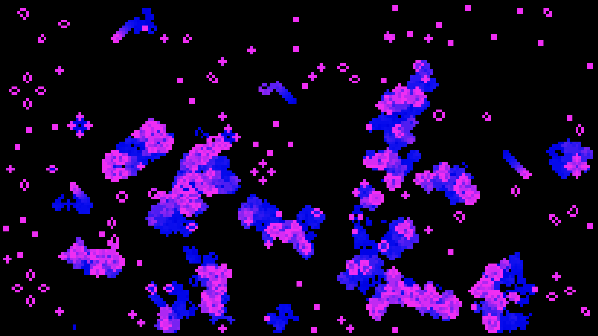
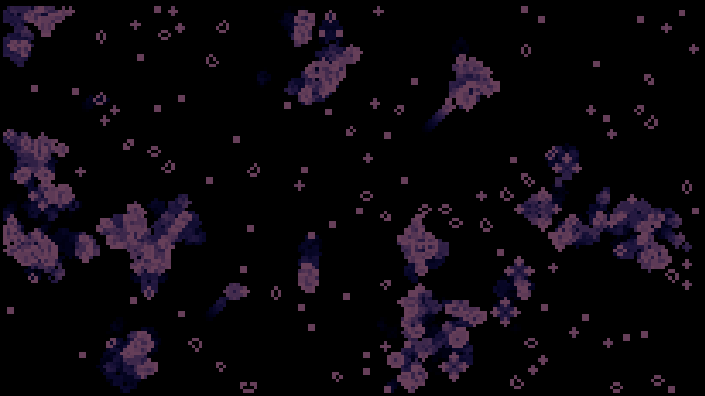
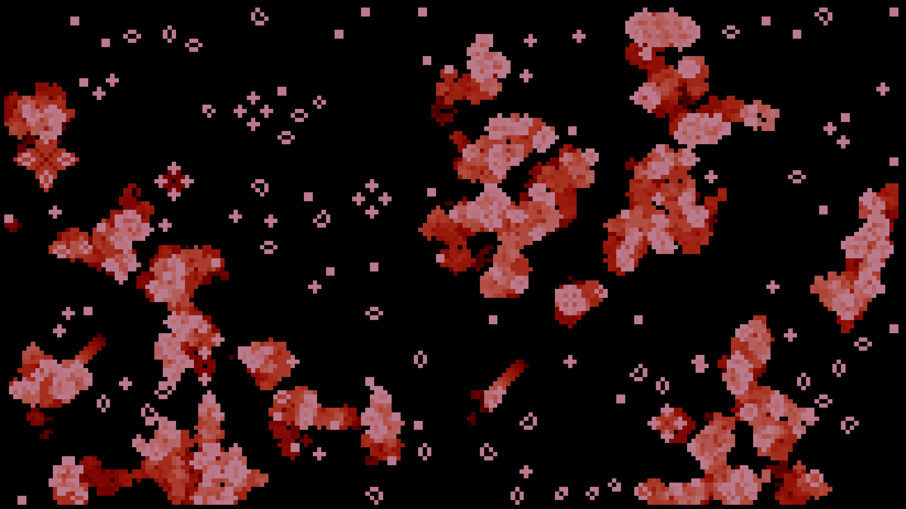

# Colourful Conway's Game of Life Simulation

A C++ graphical simulation project using OpenGL/GLFW and the Eigen matrix library. This project demonstrates real-time graphics rendering and matrix-based state management.



## Features

- Beautiful randomized colours on every run
- Real-time graphical rendering using OpenGL/GLFW
- Matrix-based world state management with Eigen
- Interactive controls for simulation reset
- Configurable world dimensions
- Smooth color transitions and intensity visualization

## Development Setup

This project uses [devenv.sh](https://devenv.sh) for development environment management.

### Prerequisites

1. Install devenv by following the [official installation guide](https://devenv.sh/getting-started/)
2. Clone and enter the repository:
```bash
git clone <repository-url>
cd <repository-name>
```
3. Initialize the development environment:
```bash
direnv allow
```

### Development Commands

- `project-compile`: Compile the project
- `project-run`: Run the compiled executable
- `project-clean`: Clean build artifacts

Example workflow:
```bash
devenv shell
project-compile
project-run
```

## Implementation Details

The project is structured into these main components:

- `src/graphics.cpp`: Manages OpenGL initialization, window creation, and rendering
- `src/logic.cpp`: Handles the simulation state and step calculations
- `src/main.cpp`: Ties everything together and manages the main loop

### Visualization Examples

Here's how the simulation looks in action:




## License

This project is open source and available under the MIT License.
